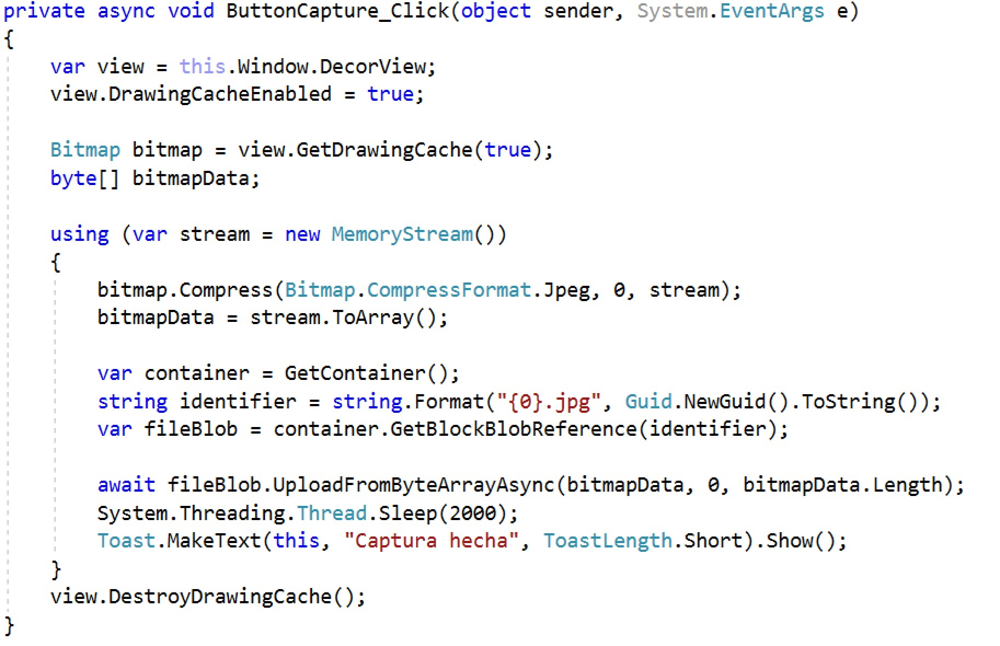

# Ejercicio de Xamarin y Azure Blob Storage

## Requisitos

Para este ejercicio lo que necesitas es una cuenta de Azure, la audiencia podrá llevar la suya propia o tú puedes crear un blob storage y darles las credenciales para que ellos entren, en el primer caso ellos podrán tomar sus propias credenciales, en el segundo caso, con que facilites la cadena de conexión de tu storage es suficiente.

## Crear tu cuenta de Blob Storage

Para crear la cuenta de Storage, debes ir primero al portal de Azure y selecciona la opción de crear un nuevo recurso de tipo **Storage account**.

Los parametros de configuración deberán lucir de la siguiente manera.

Una vez lista la aplicación, entra a la opción de **Access keys** y copia la primera cadena de conexión.

Ya tienes todo tu entorno de Azure listo, quizá valdría la pena que descargues e instales el [Azure Storage Explorer](https://storageexplorer.com/) como opción adicional, de cualquier manera, en el taller lo revisaremos por medio del portal.

Antes de terminar, crea un nuevo contenedor con el nombre que tú quieras dentro de esta cuenta.

## Tu aplicación Xamarin

Crea una aplicación en blanco de Android basada en Xamarin desde Visual Studio con el nombre que quieras.

En cuanto a la interfaz, la intención es simular cualquier tipo de dato, en este caso pondremos dos datos de tipo texto para hacer que la interfaz luzca de la siguiente manera, todo esto lo puedes hacer desde el archivo de Main.axml

Después de la inteerfaz ya hecha, agrega una nueva referencia desde un paquete de Nuget.

Busca el paquete **WindowsAzure.Storage** y agrégalo.

Ya agregado en tu proyecto iremos por las siguientes tres tareas restantes, primero vamos a agregar valores aleatorios en las cajas de texto correspondientes. En segundo lugar haremos la captura de pantalla de la aplicación y por último haremos que esa captura se suba de manera inmediata a la cuenta de Storage de Azure.

1. Para agregar los valores aleatorios, usaremos una instancia de la clase **Random** en donde meteremos valores simulando velocidad y las revoluciones de un automóvil (si, lo sé, fue lo primero que se me ocurrió, cambia a los valores que quieras). Checa el fragmento de código que se encarga de esto.

Primero debes crear la instancia que se encarga de las clases para números aleatorios.

Después puedes asociar los objetos de tipo TextView a tus controles en la interfaz así como ajustar los parámetros del temporizador.

Por último, en el manejador de eventos del temporizador, podrás enviar la información a cada caja de texto.

Hasta aquí, podrás probar con la aplicación que las cadenas de texto estan cambiando constantemente. Remarca el hecho de que el cambio de los valores sucede en un hilo aparte, por lo que debes hacer uso del método **RunOnUIThread** para que las cosas se desplieguen en la interfaz de la aplicación.

2. Para la segunda parte de funcionalidad, debes agregar primero en el método de OnCreate la instancia del botón y un manejador de eventos.

Dentro de este manejador de eventos, podrás aregar la funcionalidad de caputra de pantalla de la aplicación, ojo, solo puedes capturar la pantalla de tu aplicación, no de toda la pantalla.

Ya que tienes el arreglo de bytes listo, ya puedes irte a tu storage. Para lograrlo, vamos a la última funcionalidad.

3. En la parte final, solo debes agregar primero en la funcionalidad anterior del botón la intención de subir tu nuevo arreglo de bytes a Azure.

Dentro de la nueva funcionalidad agregada, puedes notar que estás usando un método para acceder al contenedor de tu cuenta de blob. Este método es el siguiente dentro de la aplicación. Considera agregar el nombre del contenedor que creaste en el primer paso.

Y listo, lo único que necesitas es compilar de nuevo la aplicación y después de esto, podrás ver que te aparece un mensaje de **Captura hecha** que indica que ya tu imagen está en tu blob storage.

Para confirmar que ya tienes tu imagen lista aquí, debes regresar a tu portal de Azure e ir a tu cuenta de almacenamiento, en la sección de blobs, podrás ir viendo cada una de todas las capturas de pantalla que has hecho en tu ejercicio.

## Resumen

Como puedes ver, es sumamente fácil subir nueva información a Azure, específicamente al blob sotrage. La verdad es que los SDK hacen todo el trabajo y aunque aumentan el peso de la aplicación el costo es muy bajo comparado con el hecho de hacerlo todo de forma manual, el incremento de todo el SDK de blob storage es de aproximadamente 3 MB.
