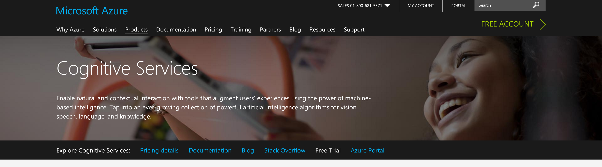
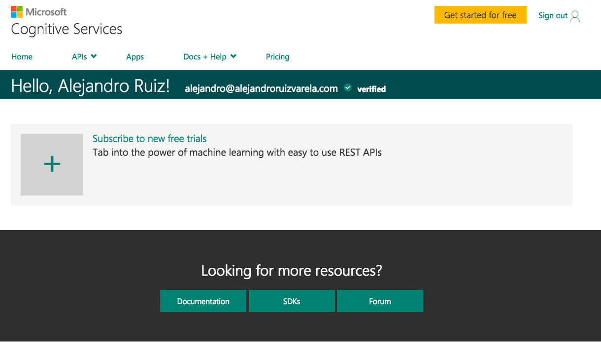
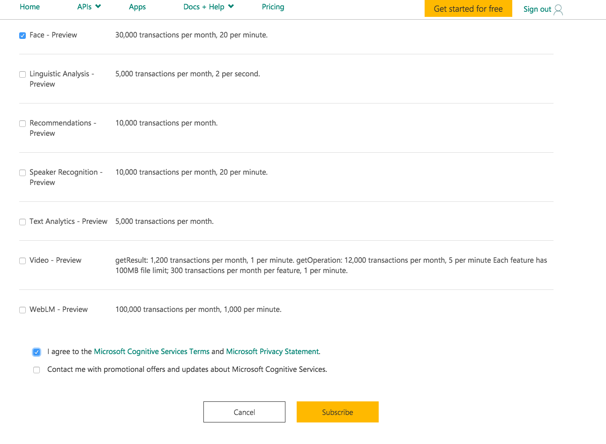
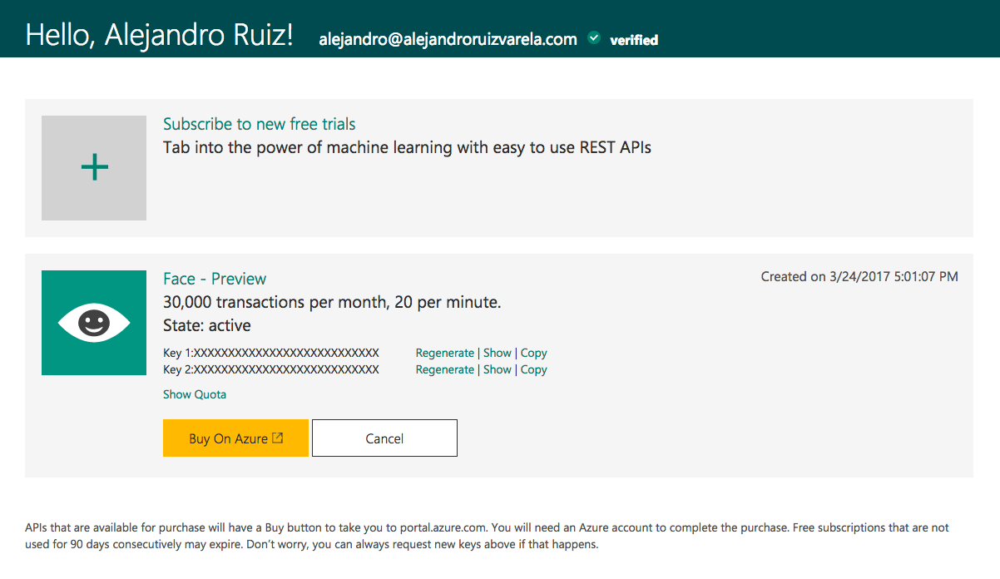
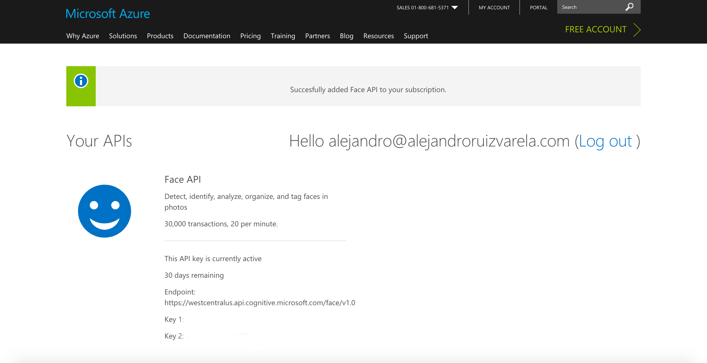

# Ejercicio Xamarin & Microsoft Cognitive Services

## Requisitos

Para poder realizar este ejercicio es necesario contar o crear una cuenta de Microsoft Cognitive Services puedes generarla directamente [aquí](https://www.microsoft.com/cognitive-services/)

## Subscribirte a Cognitive Services

En la pagina principal vamos a la sección "Free Trial" la cual nos permitirá crear implementaciones de prueba.



En el siguiente menú seleccionaremos el servicio a activar en este caso "Face API".



Lo siguiente será aceptar los términos de uso del servicio al igual seleccionar el país / región a la que pertenecemos. 



Una vez aceptando los términos de uso, ingresaremos con nuestras credenciales ( Microsoft, Github, Facebook o LinkedIn) para poder usar el servicio (Es posible recibir un correo de confirmación de correo).



A continuación podremos ver nuestras credenciales y el endpoint que deberemos de usar para poder utilizar nuestra prueba de Face API.



## Aplicacion Xamarin

Primero añadiremos el código de implementación el cual puedes encontrar [aquí](https://github.com/Microsoft/Cognitive-Face-Windows/tree/master/ClientLibrary)

### Paso 1 Inicializar el cliente y crear un id de grupo

```

FaceServiceClient = new FaceServiceClient("yourToken","yourapiurl");
_personGroupId = Guid.NewGuid().ToString();

```

### Paso 2 Crear agrupación

```

await FaceServiceClient.CreatePersonGroupAsync(_personGroupId, "MVPs In Mexico");

```

### Paso 3 Definir personas del grupo

```

var p = await FaceServiceClient.CreatePersonAsync(_personGroupId, "Nombre");

```

### Paso 4 Añadir caras a las personas

```

await FaceServiceClient.AddPersonFaceAsync(_personGroupId, p.PersonId, "Url de Foto");

```

### Paso 4 Entrenar

```

await FaceServiceClient.TrainPersonGroupAsync(_personGroupId);
//Verificar Status de entrenamiento
TrainingStatus trainingStatus = null;
while (true)
{
      trainingStatus = await FaceServiceClient.GetPersonGroupTrainingStatusAsync(_personGroupId);
			if (trainingStatus.Status != Status.Running)
			{
					break;
			}
			await Task.Delay(1000);
}

```

### Paso 5 Buscar

```

//Detectamos rostros en nuestra imagen (Stream faceData)
var faces = await FaceServiceClient.DetectAsync(faceData);

//Convertimos nuestro resultado en un arreglo 
var faceIds = faces.Select(face => face.FaceId).ToArray();

//Identificamos los Ids encontrados
var results = await FaceServiceClient.IdentifyAsync(_personGroupId, faceIds);

//Seleccionamos el primer Id de los candidatos
var result = results[0].Candidates[0].PersonId;

//Obtenemos los datos del candidato
var person = await FaceServiceClient.GetPersonAsync(_personGroupId, result);

```
